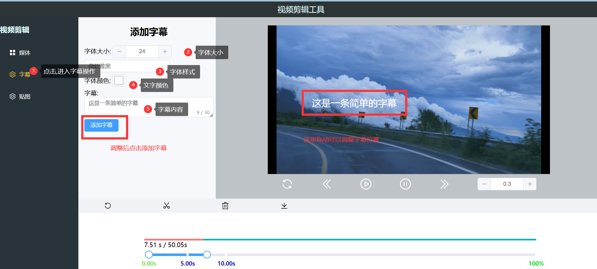

# 使用指南

###提示: 图片较多,请加载一会儿~

## 1. 主页结构说明

## 2. 选择视频文件

## 3. 字幕添加与删除

如果需要  在5s 到 10s 间播放字幕

1. 在5s分割

2. 在10s分割

3. 添加字幕

4. 删除字幕

进入响应的片段

## 4.贴图的添加与删除

## 5.删除片段

## 6.回退

支持 ctrl + z  与 点击回退

